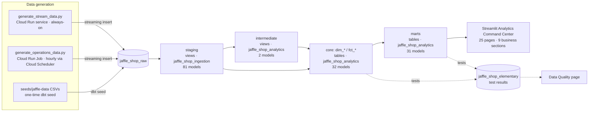
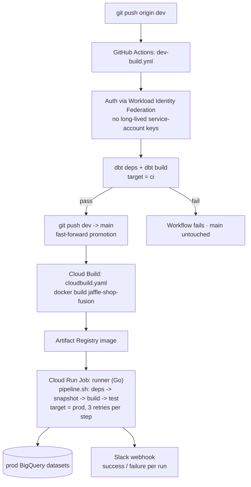
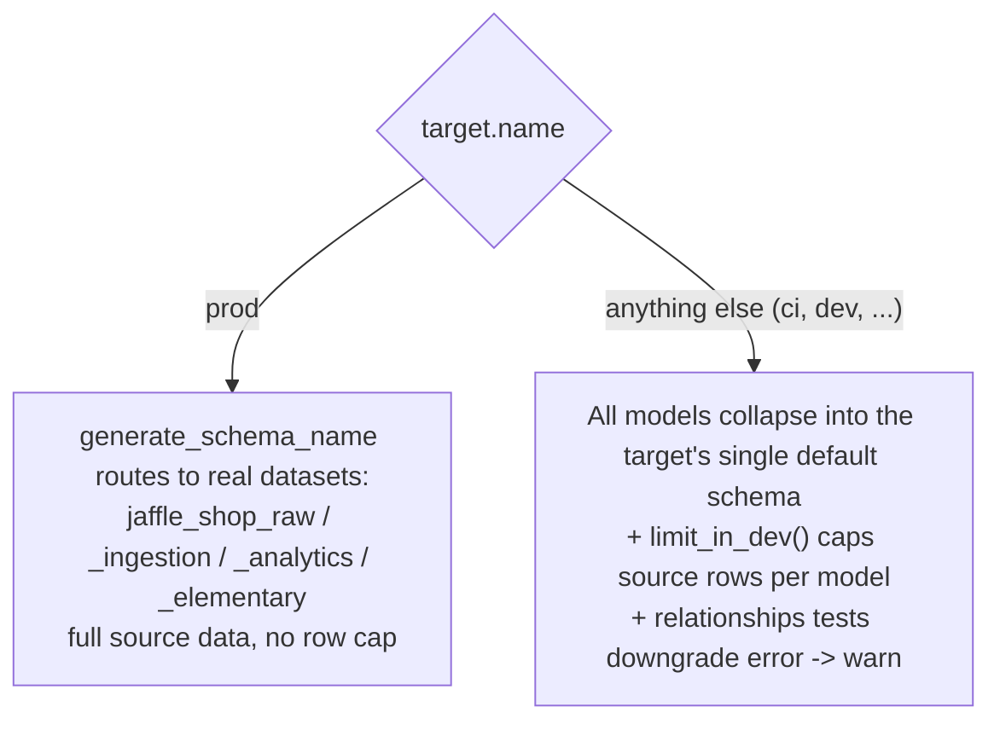
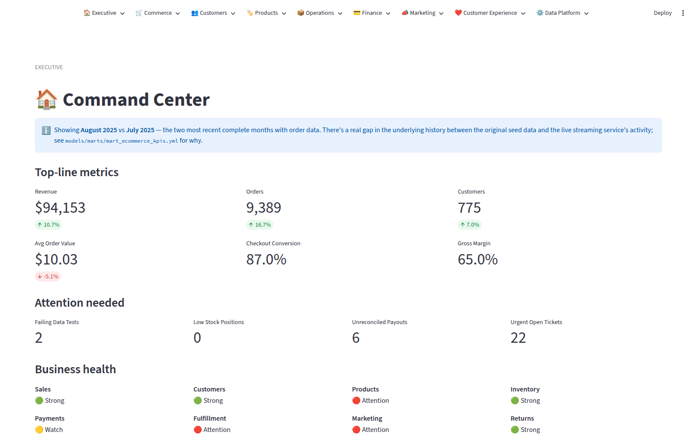
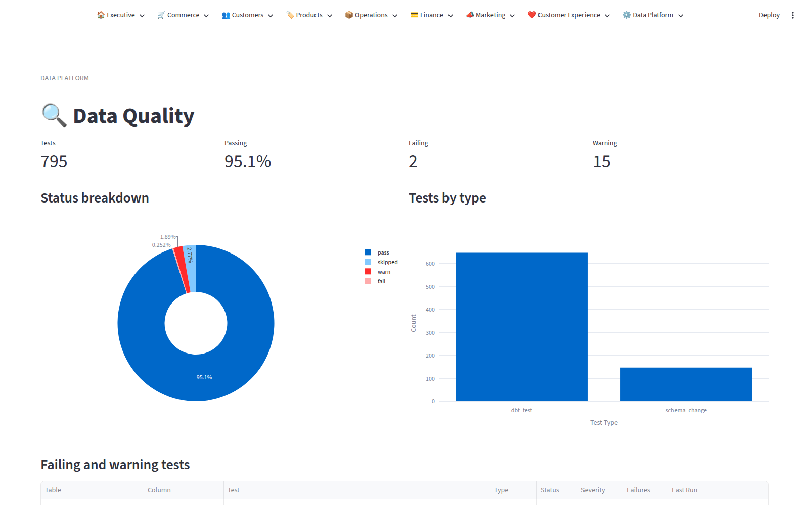
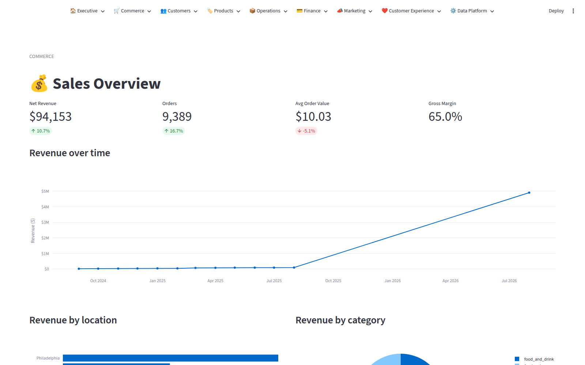

# 🥪 The Jaffle Shop 🦘

A fictional e-commerce business — the Jaffle Shop, purveyor of [jaffles](https://en.wikipedia.org/wiki/Pie_iron) — built out from dbt Labs' Jaffle Shop sandbox into a full analytics platform: 20+ modeled business domains on BigQuery, two live data generators, an automated dev→main CI/CD pipeline, and a 25-page Streamlit BI app on top.

> [!NOTE]
> **This project runs on [dbt Fusion](https://docs.getdbt.com/docs/fusion/about-fusion)** and dbt Core v1.12+, using the current Semantic Layer YAML spec (semantic models embedded in model YAML, `type: simple` metrics, top-level `type_params`).

> [!TIP]
> New to dbt itself, rather than to this project? Start with [dbt Learn](https://learn.getdbt.com/), or try [`jaffle_shop_duckdb`](https://github.com/dbt-labs/jaffle_shop_duckdb) for a zero-warehouse local walkthrough. This README assumes you already know the basics and want to understand how *this* project is put together.

## Table of contents

1. [Implementation architecture](#implementation-architecture)
   1. [System overview](#system-overview)
   2. [Data layering (medallion architecture)](#data-layering-medallion-architecture)
   3. [Business domains](#business-domains)
   4. [Live data generation](#live-data-generation)
   5. [CI/CD pipeline](#cicd-pipeline)
   6. [Environment isolation](#environment-isolation)
   7. [Testing and data quality](#testing-and-data-quality)
   8. [Analytics application (Streamlit)](#analytics-application-streamlit)
   9. [Repository structure](#repository-structure)
2. [Local development](#local-development)
   1. [Prerequisites](#prerequisites)
   2. [Clone and install](#clone-and-install)
   3. [Configure your dbt profile](#configure-your-dbt-profile)
   4. [Load data](#load-data)
   5. [Build and test](#build-and-test)
   6. [Run the Streamlit app](#run-the-streamlit-app)
3. [Testing and code quality tooling](#testing-and-code-quality-tooling)
4. [Extending the project](#extending-the-project)

## Implementation architecture

### System overview

Two always-running data generators stream directly into BigQuery, dbt transforms that raw data through four modeled layers, and a Streamlit app reads the resulting marts. Data quality results from every `dbt build`/`dbt test` land in `jaffle_shop_elementary` and surface on the Data Platform pages.



### Data layering (medallion architecture)

Established in `CONVENTIONS.md` and enforced by convention across every domain build-out:

| Layer | Folder | Schema (BigQuery dataset) | Materialization | Purpose |
|---|---|---|---|---|
| raw | `seeds/`, streamed | `jaffle_shop_raw` | table | Untouched source data — seeded once or streamed continuously by `scripts/generate_stream_data.py` / `scripts/generate_operations_data.py` |
| staging | `models/staging/` | `jaffle_shop_ingestion` | view | 1:1 with a source table. Renaming, casting, light cleaning. No joins. |
| intermediate | `models/intermediate/` | `jaffle_shop_analytics` | view | Joins, dedup, reusable business logic not yet a final entity. Not exposed to BI. |
| core | `models/core/` | `jaffle_shop_analytics` | table | Reusable dimensions (`dim_*`) and facts (`fct_*`) with a documented grain — the building blocks marts are assembled from. |
| marts | `models/marts/` | `jaffle_shop_analytics` | table | Business-facing, denormalized tables the Streamlit app queries directly. |

`intermediate` is deliberately thin (2 models) — it's only used when a domain's joins genuinely aren't a final entity yet; most domains go straight from staging to core.

### Business domains

The warehouse spans 20+ business domains, each shipped in its own build-out phase as seeds → staging → core → marts → Streamlit page(s) in one commit (see `git log` for the full phase-by-phase history). Grouped by the Streamlit section that surfaces them:

| Section | Business domains covered | Key marts |
|---|---|---|
| 🏠 Executive | Cross-domain KPI rollup + attention-needed alerting | `mart_ecommerce_kpis`, `mart_sales_performance` |
| 🛒 Commerce | Orders, cart, checkout, promotions, session funnel | `orders`, `order_items`, `mart_sales_performance`, `mart_sales_by_category`, `mart_sales_by_location`, `mart_session_funnel`, `mart_promotions` |
| 👥 Customers | Customer profile, acquisition, retention/cohorts, segmentation | `customers`, `mart_customer_360`, `mart_customer_acquisition`, `mart_customer_retention_cohorts`, `mart_customer_segments` |
| 🏷️ Products | Catalog, brands/categories, ratings | `products`, `mart_product_performance`, `mart_catalogue_health` |
| 📦 Operations | Inventory, procurement, fulfillment, shipping & delivery | `supplies`, `locations`, `mart_inventory_health`, `mart_fulfillment_performance`, `mart_shipping_delivery` |
| 💳 Finance | Payments, gift cards, returns, tax/fees, payout reconciliation | `mart_payments`, `mart_revenue_profitability`, `mart_refunds_returns`, `mart_reconciliation` |
| 📣 Marketing | Campaigns, channels, attribution | `mart_campaign_performance`, `mart_attribution` |
| ❤️ Customer Experience | Reviews, moderation, support tickets | `mart_reviews`, `mart_support` |
| ⚙️ Data Platform | dbt + Elementary run/test observability | `mart_data_quality`, `mart_pipeline_health`, `mart_model_performance` |

Every core/mart primary key carries `unique` + `not_null` tests and every foreign key a `relationships` test to its parent (see [Testing and data quality](#testing-and-data-quality)).

### Live data generation

`jaffle_shop_raw` is continuously fed by two independent Python generators, both running on Cloud Run against BigQuery via `google-cloud-bigquery` streaming inserts:

| Generator | Runs as | Scope | Notes |
|---|---|---|---|
| `scripts/generate_stream_data.py` | Cloud Run **service**, always-on (background thread + `$PORT` health check) | The 6 original reference tables: customers, orders, order_items, products, stores, supplies | Simulates a live storefront feed at a configurable `--interval` |
| `scripts/generate_operations_data.py` | Cloud Run **Job**, triggered hourly by Cloud Scheduler | Full purchase funnel: sessions → carts → checkouts → payments → fulfillment → shipments | Each run is self-contained (a cart opened this run either converts or abandons within the same run); posts a Slack notification on completion |

Because of this, there's a real ~1 year gap in `orders` history between the original seed data (ending August 2025) and the streaming service's activity (starting at "now"). The Executive Command Center labels this explicitly rather than hiding it — see `streamlit/README.md`.

### CI/CD pipeline

Pushing to `dev` is the only way changes reach production. A GitHub Actions workflow (`.github/workflows/dev-build.yml`) builds against a disposable `ci` target and only promotes to `main` if that build passes — `main` is never built against directly, so a red build can never land in production.



The Go `runner` (`runner/main.go`) wraps each `pipeline.sh` step with up to 3 retries and linear backoff, so a transient BigQuery/network blip doesn't fail an entire scheduled production run, and reports the final outcome to Slack either way.

### Environment isolation

Two macros keep CI and local `dev` runs from ever touching production data or schemas, so a bad `dbt build` on a feature branch can't corrupt `prod`:



- **`macros/generate_schema_name.sql`** — only routes models into the named production datasets (`jaffle_shop_raw`, `_ingestion`, `_analytics`, `_elementary`) when `target.name == 'prod'`. Every other target builds everything into one schema, so CI and dev runs can never write into a production dataset even by accident.
- **`macros/limit_in_dev.sql`** — appends a `limit` clause to source-reading models for any non-prod target, capping the data volume CI/dev builds churn through.
- **`macros/relationships.sql`** — because row-capping samples each source table independently, foreign keys can legitimately fail to line up across the sampled rows outside of prod. This downgrades the `relationships` test to a `warn` for non-prod targets while keeping it at full `error` severity in prod; every other test type is unaffected.

### Testing and data quality

Data quality is tracked with the [Elementary](https://www.elementary-data.com/) dbt package (`elementary-data/elementary`), which persists every `dbt test`/`dbt build` result into `jaffle_shop_elementary` and powers the Data Platform → Data Quality page. As of this writing that page reports **795 tests, 95.1% passing** (2 failing, 15 warning) — see the screenshot below.

- `unique` / `not_null` on every core/mart primary key, `relationships` on every foreign key (severity-aware per [Environment isolation](#environment-isolation)).
- `dbt_utils.expression_is_true` for cross-column business-rule invariants (e.g. `order_total = subtotal + tax_paid`).
- `unit_tests` for models with non-trivial transformation logic.
- Blanket `elementary.schema_changes` tests were originally applied to every single model to catch upstream schema drift; they were later removed project-wide to cut down redundant test surface (148 files, one line each) now that Elementary's run/test history already gives visibility into drift via the Pipeline Health and Model Performance pages.

### Analytics application (Streamlit)

Replaces an earlier Evidence.dev report. `streamlit/app.py` is a pure navigation shell — `st.navigation()` in `position="top"` mode, grouped into the same 9 business sections as the domain table above — that hands off to 25 page modules. **dbt owns business logic, Streamlit only presents it**: every number comes from a mart in `models/marts/`, pages and `streamlit/queries/*.py` only select and format (see `CONVENTIONS.md` and `streamlit/README.md`).

Auth uses a read-only `evidence-reporting` BigQuery service account, wired through Streamlit Secrets (`st.secrets["gcp_service_account"]`) so the identical code runs locally and on Streamlit Community Cloud.

<table>
<tr>
<td width="50%">

**Executive Command Center** — top-line KPIs, cross-domain "attention needed" alerts, and a business-health grid, one glance across all 9 sections.



</td>
<td width="50%">

**Data Platform → Data Quality** — live Elementary test results: pass/warn/fail breakdown and a failing/warning tests table, sourced from `mart_data_quality`.



</td>
</tr>
</table>

**Commerce → Sales Overview** — revenue trend, revenue by location and category, driven entirely by `mart_sales_performance` and friends. Note the visible step up around Aug 2025: that's the seed-data → live-streaming-data handoff described in [Live data generation](#live-data-generation), left visible rather than smoothed over.



The nav bar's pill row is centered via targeted CSS in `app.py` (built against Streamlit's stable `data-testid` attributes, not its build-specific emotion-hash classnames) rather than Streamlit's default left-packed layout.

### Repository structure

```
jaffle-shop/
├── models/
│   ├── staging/        # 81 models — 1:1 with a raw source table
│   ├── intermediate/   # 2 models  — cross-table joins not yet a final entity
│   ├── core/            # 32 models — dim_*/fct_* with a documented grain
│   └── marts/            # 31 models — business-facing, denormalized
├── seeds/jaffle-data/   # one-time reference CSVs (customers, orders, products, ...)
├── snapshots/            # SCD2 tracking (e.g. customer accounts)
├── macros/                # generate_schema_name, limit_in_dev, relationships, cents_to_dollars
├── data-tests/             # singular (non-generic) data tests
├── scripts/
│   ├── generate_stream_data.py       # always-on streaming generator (Cloud Run service)
│   ├── generate_operations_data.py    # hourly batch generator (Cloud Run Job)
│   ├── generate_*_domain_seeds.py      # one-time seed generators, one per business domain
│   ├── Dockerfile / operations-job.Dockerfile / cloudbuild.yaml
│   └── requirements.txt
├── runner/               # Go binary: retries pipeline.sh steps, notifies Slack
├── pipeline.sh           # deps / seed / snapshot / build / test entrypoint
├── docker/profiles.yml   # prod BigQuery connection profile baked into the image
├── Dockerfile            # multi-stage: builds runner, then the dbt + runner image
├── cloudbuild.yaml       # Cloud Build: builds & pushes the jaffle-shop-fusion image
├── .github/workflows/dev-build.yml   # dev -> ci build -> main promotion
├── streamlit/
│   ├── app.py             # navigation shell (st.navigation, 9 sections, 25 pages)
│   ├── pages/<section>/   # one folder per business section
│   ├── components/         # kpi_cards, charts, filters, data_table, ...
│   ├── queries/              # thin pass-throughs to marts, no business logic
│   └── utils/                  # bigquery client, config constants, formatting
├── CONVENTIONS.md        # layering, keys, testing, and naming conventions for new domains
└── dbt_project.yml
```

## Local development

### Prerequisites

- Python 3.12
- A BigQuery project you can build into, with a user or service account that has permission to create/write datasets (this project's own instance runs on `jaffle-shop-505616`, but you don't need access to that project — any BigQuery project works for local dev)
- _Optional_: Go 1.23+, only if you're changing `runner/`

### Clone and install

```bash
git clone [this repo]
python3 -m venv .venv
source .venv/bin/activate
python3 -m pip install -r requirements.txt
python3 -m pip install dbt-core dbt-bigquery
dbt deps
```

### Configure your dbt profile

Create `~/.dbt/profiles.yml` (or a project-local `profiles.yml`, already gitignored) with a target **named anything other than `prod`** — the target name is what the [environment isolation](#environment-isolation) macros key off of, so any other name (`dev`, your own name, `ci`, ...) automatically gets the safety rails: everything collapses into one schema, source reads are row-capped, and `relationships` tests only warn instead of failing the build.

```yaml
jaffle_shop:
  target: dev
  outputs:
    dev:
      type: bigquery
      method: oauth
      project: your-gcp-project-id
      dataset: jaffle_shop_dev
      threads: 4
      timeout_seconds: 300
      location: US
```

### Load data

For a quick start, seed the sample data bundled in the repo:

```bash
dbt seed --full-refresh --vars '{"load_source_data": true}'
```

For a larger synthetic dataset (up to 10 years), use `jafgen` via the bundled `Taskfile.yml`:

```bash
task load YEARS=6 DB=bigquery
```

This spins up a temporary venv, generates the data, seeds it, and cleans up after itself — see `Taskfile.yml` for the individual steps if you'd rather run them by hand.

### Build and test

```bash
dbt build   # runs models + tests
dbt test    # tests only
```

### Run the Streamlit app

```bash
cd streamlit
python3 -m venv .venv
.venv/bin/pip install -r requirements.txt
```

Add BigQuery credentials to `streamlit/.streamlit/secrets.toml` (gitignored) as a `[gcp_service_account]` table — see `streamlit/README.md` for the exact format and the Streamlit Community Cloud deployment path. Then:

```bash
.venv/bin/streamlit run app.py
```

## Testing and code quality tooling

- **[Elementary](https://www.elementary-data.com/)** persists dbt test/run results to `jaffle_shop_elementary` for the Data Platform pages — see [Testing and data quality](#testing-and-data-quality).
- **[pre-commit](https://pre-commit.com/)** runs `ruff` (lint + format for any Python), `check-yaml`, `end-of-file-fixer`, `trailing-whitespace`, and `requirements-txt-fixer` on every commit. Installed via `requirements.txt`; opt in with `pre-commit install`, or run ad hoc with `pre-commit run --all-files`.
- **SQLFluff** config (`.sqlfluff`) is present but not currently wired into pre-commit or CI.

## Extending the project

Adding a new business domain? Read `CONVENTIONS.md` first — it defines the layering rules, key/grain conventions, and testing pattern every existing domain follows, established during the Phase 1 (Foundation) build-out and extended (not forked) with each new domain since.
